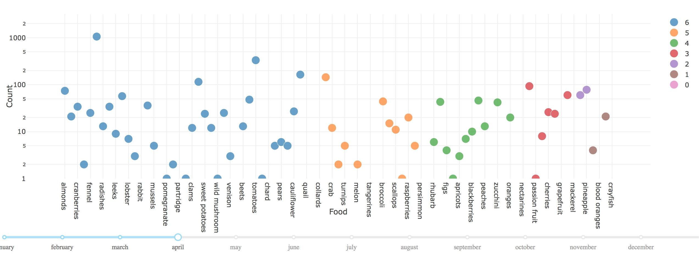

## To be in season or not to be in season: a food consumption analysis

  <strong>By Kate Dopiro, Fabien Zellweger & Christopher Benz</strong>

  <em>Data story for the end-of-semester project of the ADA course at EPFL.</em>

  This page is best viewed in the Chromium browser. Other browsers such as Firefox may not display some mvisualizations correctly.

<h1>Introduction</h1>

Are we eating foods when we are supposed to?
  

From the dawn of humankind, man has evolved to find, hunt or grow food. Whether it is a
freshly killed bear or home-grown crops there is a great knowledge as to how exactly to
proceed. It has been acquired by generations leading to the fine abundance and choice we
have today.
  

One of the key aspects is the time. The season when the crops have been planted
ultimately decides when they can be harvested to make some great bread, just as the mating
period of animals indicates the best time to hunt for them. Moreover, in case of crops, the time
of planting decided if they are going to service or not.

Hopefully we have convinced you enough that time of season makes a great difference. This is at the core of our study.
Every food has its season, for example oranges - winter and sweet potatoes - summer. There has not been
a proper study to investigate if consuming foods during their natural seasons has any health
benefits, but one could potentially imagine such as the unseasoned foods are usually imported
from far away and so either treated with preservatives or are not so fresh. Therefore there are
two aspects we are doing to look at: the season the foods are naturally produced, and the area
where they are naturally produced.

<h1>Data analysis</h1>

First off let us explain how we obtained all the data. We found two websites containing
information about food and their seasons: “eat the seasons” and “seasonal food guide”. We
crawled both. The “eat the seasons” is advantageous as it contains information about greater
range of foods: meat, fish, vegetables, but not information about the native area. The “seasonal
food guide” contains all the needed information but covers only vegetables. Further on we
explain the usage of each.

Once we had the information about the foods and their native region, we picked up one of the
proposed datasets. In order to estimate the consumption of different foods we base our
estimate on recipes. A recipe contains the list of ingredients that directly correspondents to our
list of studied foods. However extracting the data proves to be more difficult. We made an
assumption that either the first review is of the same month as the recipe post or the most
popular month is the month of recipe usage. The logic behind is that either people react and
use the recipe as soon as it is posted and so they react to it, or people come back to it
regularly, as for example people would come back to the recipe of Thanksgiving turkey every
year the same month. As a result we have an estimate of human consumption patterns per
food.

In order to rank the food consumption as seasonal or not we introduce a score. That score is
equal to the 6 minus the number of months in between the month in question and the closest
month of the season for that food. It allows for the difference to be both ways and it measures
the time to the closest season month. This metric also allows to estimate how far the
production of the food in question has to be to accommodate thermal requirements.

….map…

Another way to visualize the data is to plot the foods against the consumption. That is what the
second visualization is striving to achieve. Unfortunately for this purpose the “seasonal food
guide” was no good as it significantly raised the score of the food that month, what didn’t
appear to be realistic. Therefore we limited our scope to the foods in the “eat the seasons”
dataset. The consumption is computed trivially as the counts that particular food appeared in
recipes dating that particular month. As a result we have a visualization of food consumption.
We can see that garlic seems to be highly consumed no matter the season. That could
possibly be explained by the fact that it is usually used as spice. Otherwise consumption at the
correct season seems to dominate during the late winter and spring months, while during
summer and autumn there is much more un seasonal consumption.

<h1>Results</h1>

  Due to a shortage of time before the deadline, we were not able to display our visualizations in html. Here are some screenshots of the graph instead, which was created with Dash for plotly. It is possible to select the month with a slider below the graph, and observe the score for each food on a logarithmic scale. The higher the score, the greater the chance it's a seasonal food.

<!--<link rel="import" href="us_map.html">-->

<h1>Difficulties</h1>

  - We ran out of time before the deadline and didn't manage to complete everything we wanted, or clean up the notebook nicely.

  - The dataset contained data from many websites, and we had to scrap the data with an individual method for each site. We took only the sites with most data and therefore our analysis contains only 50% of the full dataset data.

  - Our matching between ingredients and foods to find the season is not perfect

<iframe src="//46.101.113.201:6090/dash-fig1" width="100%" height="400">hmm kay</iframe>

  <a href="http://46.101.113.201:6090/dash-fig1"  target="_blank">External link</a>

<h1>Citations</h1>

@inproceedings{WestWhiteHorvitzWWW2013,
  title={		From Cookies to Cooks: Insights on Dietary Patterns via Analysis of Web Usage Logs},
  author={		Robert West and Ryen W. White and Eric Horvitz},
  booktitle={	Proceedings of the 22nd International World Wide Web Conference},
  year={		2013}
}

